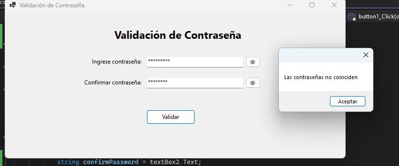
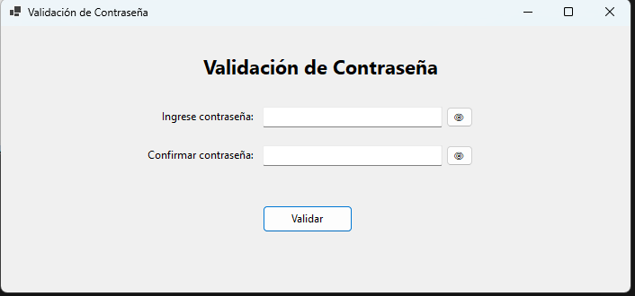
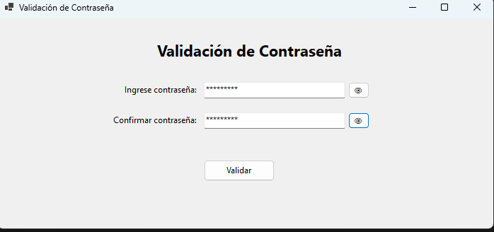
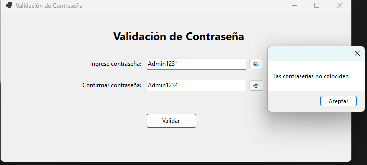
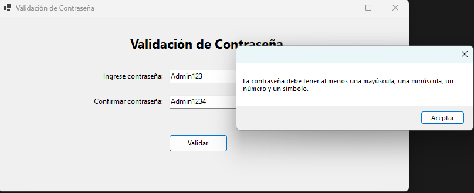
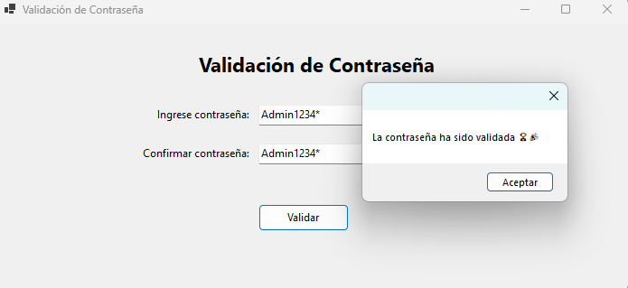

# HelloApp

Aplicación de validación de contraseñas en Windows Forms (.NET 10, C# 14.0)

## Descripción

HelloApp es una aplicación sencilla que permite validar contraseñas según los siguientes requisitos:
- Al menos una letra mayúscula
- Al menos una letra minúscula
- Al menos un número
- Al menos un símbolo
- Confirmación de contraseña

Incluye botones para mostrar/ocultar la contraseña y la confirmación. Al validar correctamente, muestra un mensaje con emojis de victoria.

## Requisitos

- Visual Studio 2022
- .NET 10
- C# 14.0

## Uso

1. Ingresa la contraseña y la confirmación.
2. Haz clic en "Validar".
3. Si la contraseña cumple los requisitos y ambas coinciden, verás el mensaje de éxito 🏆🎉.
4. Usa los botones 👁 para mostrar/ocultar los campos de contraseña.

## Imágenes de funcionamiento

A continuación se muestran capturas del funcionamiento de la aplicación:

## Estructura del proyecto

- `Form1.cs`: Lógica principal de la aplicación.
- `Form1.Designer.cs`: Definición de los controles de la interfaz.
- `Form1.resx`: Recursos de la interfaz.
- `img/`: Carpeta con imágenes de ejemplo del funcionamiento.

## Ejecución

Abre el proyecto en Visual Studio 2022 y ejecuta (F5).

## Licencia

MIT
